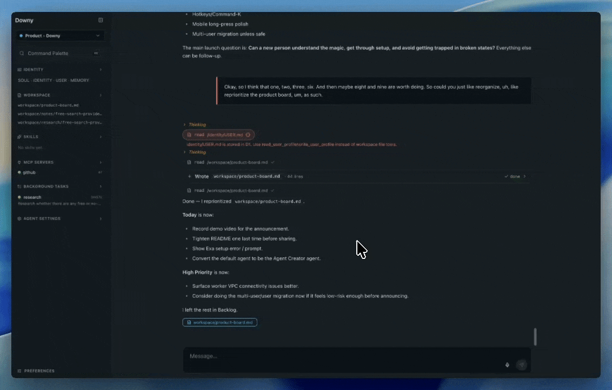

# Downy

Build a team of agents and work with them from any device.

- Best UX for working with multiple agents.
- Each agent has its own personality, skills, tools, and workspace.
- OpenAI Sub compatible for frontier models at a flat rate. Or, use any model on OpenRouter or Workers AI.



## Why Downy

- **Self-hosted.**
  - Runs in your Cloudflare account or locally.
- **Multi-agent w/ purpose built UX.**
  - Each agent has its own personality, skills, tools, and workspace.
  - Manage workspaces, tools, and background tasks directly in the app — no Obsidian, no CLI.
- **Use w/ any Model, including your OpenAI Sub.**
  - Kimi 2.6 on Workers AI by default — no API keys to wire up.
  - Swap in [ChatGPT Plus/Pro](#optional-chatgpt-subscription) or any OpenRouter model when you want.
- **Access anywhere.**
  - Reach Downy from any device behind Cloudflare's secure network.

## Architecture

```
[Your devices] --SSO+MFA--> [Cloudflare Access]
                                    |
                              signed JWT
                                    v
                            [Downy Worker]
                          /       |        \
                  [D1/R2/DOs] [Kimi]   [VPC binding] (optional)
                                            |
                                            v
                                    [cloudflared tunnel]
                                            |
                                            v
                                  [Pi proxy on your host]
```

Full system map: [`docs/architecture.md`](docs/architecture.md).

## Deploy

You'll need:

- **Node 24 LTS** and **pnpm**:
  ```bash
  nvm install 24 && nvm use 24
  npm install -g pnpm
  ```
- **Cloudflare account** — the free Workers plan works if you bring your own model.
  - Workers AI (the default Kimi setup) needs the **Workers Paid plan** ($5/mo).
  - Pi proxy (ChatGPT) and OpenRouter both run on the free plan.
- **[Exa](https://exa.ai) API key** — free $10 credit, effectively unlimited for personal use. Required for search.

Then, clone the repo, set it up locally, and deploy.

```bash
git clone https://github.com/bensenescu/downy
cd downy
pnpm install
pnpm alchemy login            # one-time browser OAuth to your Cloudflare account
cp .env.example .env          # then fill in EXA_API_KEY and ALCHEMY_PASSWORD (random string)
pnpm deploy
```

A note on `pnpm deploy`:

- Powered by [Alchemy](https://alchemy.run) (infrastructure as TypeScript) — config lives in [`alchemy.run.ts`](alchemy.run.ts).
- Provisions every Cloudflare resource and syncs `.env` secrets in one shot.
- Idempotent — re-run any time.

The Worker rejects every request until Cloudflare Access is in front of it — that's next.

<details>
<summary>No <code>*.workers.dev</code> URL yet?</summary>

Enable it at **Workers & Pages → downy → Settings → Domains & Routes** (three-dot menu next to `workers.dev`).

</details>

<details>
<summary>Want to use OpenRouter for inference?</summary>

Add both `OPENROUTER_API_KEY` and `OPENROUTER_MODEL_ID` (e.g. `anthropic/claude-sonnet-4-5`) to `.env` and re-run `pnpm deploy`. Selectable in Settings → Preferences.

</details>

## Authentication: Cloudflare Access

Access enforces SSO + MFA at Cloudflare's edge before any request reaches your Worker — there's no path around the gate, even via the raw `*.workers.dev` URL.

1. **Go to your Worker's settings** in the Cloudflare dashboard:
   - Open the sidebar and find **Workers & Pages**.
   - Click into your **downy** worker.
   - Open the **Settings** tab.
2. **Turn on Cloudflare Access:**
   - Under **Domains & Routes**, click the three-dot menu next to your `workers.dev` value.
   - Toggle **Cloudflare Access** on.
   - A modal pops up with your `TEAM_DOMAIN` and `POLICY_AUD`.
3. **Copy those values into `.env`:**
   - `TEAM_DOMAIN=https://<team>.cloudflareaccess.com`
   - `POLICY_AUD=<aud-tag>`
4. `pnpm deploy`, then open your Worker URL and log in.

<details>
<summary>Sign-in works but you still see "Authentication required"?</summary>

`pnpm tail` shows the verifier's failure reason — usually `TEAM_DOMAIN` missing `https://` or a stale `POLICY_AUD`.

</details>

<details>
<summary>Deploy fails with <code>VPC service ... does not exist</code>?</summary>

`PI_RELAY_VPC_SERVICE_ID` should be unset in `.env` by default. If you set it, either remove it or follow [`docs/pi-proxy-setup.md`](docs/pi-proxy-setup.md) to provision the VPC service.

</details>

## Optional: ChatGPT subscription

Point Downy at your **ChatGPT Plus/Pro subscription** instead of Kimi:

- **Smarter models at a flat rate** — no per-token API billing.
- **Secure by network boundary** — a small proxy on your hardware holds the OAuth tokens, reached only via a Cloudflare Tunnel + Workers VPC binding (never the public internet).
- **Walkthrough:** [`docs/pi-proxy-setup.md`](docs/pi-proxy-setup.md).

> Note: OpenAI currently allows third-party harnesses to use ChatGPT subscriptions for personal use, but that policy could change.

## CI

```bash
pnpm run ci:check       # prettier + knip + tsc + oxlint
pnpm run format:write
pnpm run lint:fix
```
